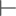
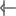
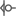
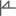
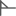
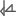

:TOC:

.Summary An introduction to the s-expression file format.
<!--more-->

== Introduction

KiCad uses an s-expression file format for symbol libraries, footprint libraries,
schematics, printed circuit boards, and title block and border worksheets.

=== Syntax

* Syntax is based on the Specctra DSN file format.
* Token definitions are delimited by opening `(` and closing `)` parenthesis.
* All tokens are lowercase.
* Tokens cannot contain any white space characters or special characters other than the
  underscore '_' character.
* All strings are quoted using the double quote character (") and are UTF-8 encoded.
* Tokens can have zero or more attributes.
* Human readability is a design goal.

=== Conventions

In order to use the file format documentation properly, there are a few notation conventions
 that must be understood.

* Token attributes are upper case descriptive names.  For example `(at X Y)`, X is the
  horizontal coordinate and Y is the vertical coordinate.
* Some tokens have a limited number of possible attribute values which are separated by a
  logical or character '|'.  For example `(visible yes|no)` the only valid attributes for
  the `visible` token are `yes` or `no`.
* Some tokens have optional attributes which are enclosed in square braces.  For example
  `(paper A0 [portrait])` the page portrait setting is optional.


=== Coordinates and Sizes

* All values are given in millimeters.
* Exponential floating point values are not used for readability purposes.
* All coordinates are relative to the origin of their containing object.


== Common Syntax

This section defines all syntax that is shared across the symbol library, footprint library,
schematic, board, and work sheet file formats.


=== Library Identifier

The xref:../sexpr-symbol-lib/index.adoc#_introduction[schematic symbol library] and
xref:../sexpr-footprint/index.adoc#_introduction[printed circuit board footprint library]
file formats use library identifiers.  Library identifiers are defined as a quoted string
using the "LIBRARY_NICKNAME:ENTRY_NAME" format where "LIBRARY_NICKNAME" is the nickname
of the library in the symbol or footprint library table and "ENTRY_NAME" is the name of
the symbol or footprint in the library separated by a colon.

NOTE: The "LIBRARY_NICKNAME" is not stored in the library files because a library cannot know
      what the assigned library table nickname is in advance.  Only the "ENTRY_NAME" is saved
      in the library files.


=== Position Identifier

The `at` token defines the positional coordinates and rotation of an object.

```
  (at
    X                                                           <1>
    Y                                                           <2>
    [ANGLE]                                                     <3>
  )
```

<1> The X attribute defines the horizontal position of the object.
<2> The Y attribute defines the vertical position of the object.
<3> The optional ANGLE attribute defines the rotational angle of the object.  Not all objects have
    rotational position definitions.

NOTE: Symbol `text` ANGLEs are stored in tenth's of a degree.  All other ANGLEs are stored in
      degrees.


=== Coordinate Point List

The `pts` token defines a list of X/Y coordinate points.

```
  (pts
    (xy X Y)                                                    <1>
    ...
    (xy X Y)
  )
```

<1> The `xy` token defines a single X and Y coordinate pair.  The number of points is determined
    by the object type.


=== Stroke Definition

The `stroke` token defines how the outlines of graphical objects are drawn.

```
  (stroke
    (width WIDTH)                                               <1>
    (type TYPE)                                                 <2>
    (color R G B A)                                             <3>
  )
```

<1> The `width` token attribute defines the line width of the graphic object.
<2> The `type` token attribute defines the line style of the graphic object.  Valid stroke line styles
    are:
* `dash`
* `dash_dot`
* `dash_dot_dot`  (from version 7)
* `dot`
* `default`
* `solid`
<3> The `color` token attributes define the line red, green, blue, and alpha color settings.


=== Text Effects

All text objects can have an optional `effects` section that defines how the text is displayed.

```
  (effects
    (font                                                       <1>
      [(face FACE_NAME)]                                        <2>
      (size HEIGHT WIDTH)                                       <3>
      [(thickness THICKNESS)]                                   <4>
      [bold]                                                    <5>
      [italic]                                                  <6>
      [(line_spacing LINE_SPACING)]                             <7>
    )
    [(justify [left | right] [top | bottom] [mirror])]          <8><9>
    [hide]                                                      <10>
  )
```

<1> The `font` token attributes define how the text is shown.
<2> The optional `face` token indicates the font family.  It should be a TrueType font family
    name or "KiCad Font" for the KiCad stroke font.  (from version 7)
<3> The `size` token attributes define the font height and width.
<4> The `thickness` token attribute defines the line thickness of the font.
<5> The `bold` token specifies if the font should be bold.
<6> The `italic` token specifies if the font should be italicized.
<7> The `line_spacing` token specifies the spacing between lines as a ratio of standard line-spacing.
    (Not yet supported)
<8> The optional `justify` token attributes define if the text is justified horizontally `right`
    or `left` and/or vertically `top` or `bottom` and/or mirrored.  If the justification is not
    defined, then the text is center justified both horizontally and vertically and not mirrored.
<9> The `mirror` token is only supported in the PCB Editor and Footprints.
<10> The optional `hide` token defines if the text is hidden.


=== Page Settings

The `paper` token defines the drawing page size and orientation.

```
  (paper
    PAPER_SIZE | WIDTH HEIGHT                                   <1>
    [portrait]                                                  <2>
  )
```

<1> Valid pages sizes are A0, A1, A2, A3, A4, A5, A, B, C, D, and E or the WIDTH and HEIGHT
    attributes are used for custom user defined page sizes.
<2> The `portrait` token defines if the page is shown in the portrait mode.  If not defined,
    the landscape page layout mode is used.


=== Title Block

The `title_block` token defines the contents of the title block.

```
  (title_block
    (title "TITLE")                                             <1>
    (date "DATE")                                               <2>
    (rev "REVISION")                                            <3>
    (company "COMPANY_NAME")                                    <4>
    (comment N "COMMENT")                                       <5>
  )
```

<1> The `title` token attribute is a quoted string that defines the document title.
<2> The `date` token attribute is a quoted string that defines the document date using the
    YYYY-MM-DD format.
<3> The `rev` token attribute is a quoted string that defines the document revision.
<4> The `company` token attribute is a quoted string that defines the document company name.
<5> The `comment` token attributes define the document comments where N is a number from 1
    to 9 and COMMENT is a quoted string.


=== Properties

The `property` token defines a key value pair for storing user defined information.

```
  (property
    "KEY"                                                       <1>
    "VALUE"                                                     <2>
  )
```

<1> The property key attribute is a string that defines the name of the property.  Property keys
    must be unique.
<2> The property value attribute is a string associated with the key attribute.


=== Universally Unique Identifier

The `uuid` token defines an universally unique identifier.

```
  (uuid
    UUID                                                        <1><2>
  )
```

<1> The UUID attribute is a Version 4 (random) UUID that should be globally unique.  KiCad
UUIDs are generated using the https://en.wikipedia.org/wiki/Mersenne_Twister[mt19937 Mersenne Twister]
algorithm.

<2> Files converted from legacy versions of KiCad (prior to 6.0) have their locally-unique
timestamps re-encoded in UUID format.


=== Images

The `image` token defines an embedded image.  This section will not exist if no images
are present.

```
  (image
    POSITION_IDENTIFIER                                         <1>
    [(scale SCALAR)]                                            <2>
    [(layer LAYER_DEFINITIONS)]                                 <3>
    UNIQUE_IDENTIFIER                                           <4>
    (data IMAGE_DATA)                                           <5>
  )
```

<1> The POSITION_IDENTIFIER defines the
    xref:../sexpr-intro/index.adoc#_position_identifier[X and Y coordinates] of the image.
<2> The optional `scale` token attribute defines the SCALE_FACTOR of the image.
<3> The `layer` token attribute defines the associated board layer of the image using one
    <<_canonical_layer_names,canonical layer name>>.
    Only used by board and footprint images.
<4> The UNIQUE_IDENTIFIER defines the
    xref:../sexpr-intro/index.adoc#_universally_unique_identifier[universally unique identifier]
    for the image.
<5> The `data` token attribute defines the image data in the
    https://en.wikipedia.org/wiki/Portable_Network_Graphics[portable network graphics format (PNG)]
    encoded with https://en.wikipedia.org/wiki/Base64#MIME[MIME type base64].


== Board Common Syntax

This section defines all syntax that is shared across the footprint library and printed
circuit board file formats.


== Board Coordinates

* The minimum internal unit for printed circuit board and footprint files is one nanometer so
  there is maximum resolution of six decimal places or 0.000001 mm.  Any precision beyond six
  places will be truncated.


== Layers

All drawable board and footprint objects exist on a `layer` which is defined in the drawable
 item definition.  All layers can be renamed by the user.

NOTE: Internally, all layer names are canonical.  User defined layer names are only used for
      display and output purposes.

```
  (layer
    LAYER_DEFINITION                                            <1>
  )
```

<1> Layer definitions can be specified as a list of one or more
    <<_canonical_layer_names,canonical layer names>> or with a '*' wildcard to represent all
    layers that match the rest of the wildcard.  For instance, `pass:[*].Cu` represents all
    of the  copper layers.  This only applies to
    <<_canonical_layer_names, canonical layers names>>.

=== Capacity

* 60 total layers.
* 32 copper layers.
* 8 paired technical layers for silk screen, solder mask, solder paste, and adhesive.
* 4 user pre-defined layers for drawings, engineering change order (ECO), and comments.
* 1 layer to define the board outline.
* 1 layer to define the board margins.
* 9 optional user definable layers.

=== Canonical Layer Names

The table below list all of the canonical layer names used in the file format.

[options="header"]
|====================================================
|Canonical Name | Description
|F.Cu | Front copper layer
|In1.Cu | Inner copper layer 1
|In2.Cu | Inner copper layer 2
|In3.Cu | Inner copper layer 3
|In4.Cu | Inner copper layer 4
|In5.Cu | Inner copper layer 5
|In6.Cu | Inner copper layer 6
|In7.Cu | Inner copper layer 7
|In8.Cu | Inner copper layer 8
|In9.Cu | Inner copper layer 9
|In10.Cu | Inner copper layer 10
|In11.Cu | Inner copper layer 11
|In12.Cu | Inner copper layer 12
|In13.Cu | Inner copper layer 13
|In14.Cu | Inner copper layer 14
|In15.Cu | Inner copper layer 15
|In16.Cu | Inner copper layer 16
|In17.Cu | Inner copper layer 17
|In18.Cu | Inner copper layer 18
|In19.Cu | Inner copper layer 19
|In20.Cu | Inner copper layer 20
|In21.Cu | Inner copper layer 21
|In22.Cu | Inner copper layer 22
|In23.Cu | Inner copper layer 23
|In24.Cu | Inner copper layer 24
|In25.Cu | Inner copper layer 25
|In26.Cu | Inner copper layer 26
|In27.Cu | Inner copper layer 27
|In28.Cu | Inner copper layer 28
|In29.Cu | Inner copper layer 29
|In30.Cu | Inner copper layer 30
|B.Cu | Back copper layer
|B.Adhes | Back adhesive layer
|F.Adhes | Front adhesive layer
|B.Paste | Back solder paste layer
|F.Paste| Front solder paste layer
|B.SilkS | Back silk screen layer
|F.SilkS | Front silk screen layer
|B.Mask | Back solder mask layer
|F.Mask | Front solder mask layer
|Dwgs.User | User drawing layer
|Cmts.User | User comment layer
|Eco1.User | User engineering change order layer 1
|Eco2.User | User engineering change order layer 2
|Edge.Cuts | Board outline layer
|F.CrtYd | Footprint front courtyard layer
|B.CrtYd | Footprint back courtyard layer
|F.Fab | Footprint front fabrication layer
|B.Fab | Footprint back fabrication layer
|User.1 | User definable layer 1
|User.2 | User definable layer 2
|User.3 | User definable layer 3
|User.4 | User definable layer 4
|User.5 | User definable layer 5
|User.6 | User definable layer 6
|User.7 | User definable layer 7
|User.8 | User definable layer 8
|User.9 | User definable layer 9
|====================================================


=== Footprint

The `footprint` token defines a footprint.

NOTE: Prior to version 6, the `footprint` token was referred to as `module`.

```
  (footprint
    ["LIBRARY_LINK"]                                            <1>
    [locked]                                                    <2>
    [placed]                                                    <3>
    (layer LAYER_DEFINITIONS)                                   <4>
    (tedit TIME_STAMP)                                          <5>
    [(uuid UUID)]                                               <6>
    [POSITION_IDENTIFIER]                                       <7>
    [(descr "DESCRIPTION")]                                     <8>
    [(tags "NAME")]                                             <9>
    [(property "KEY" "VALUE") ...]                              <10>
    (path "PATH")                                               <11>
    [(autoplace_cost90 COST)]                                   <12>
    [(autoplace_cost180 COST)]                                  <13>
    [(solder_mask_margin MARGIN)]                               <14>
    [(solder_paste_margin MARGIN)]                              <15>
    [(solder_paste_ratio RATIO)]                                <16>
    [(clearance CLEARANCE)]                                     <17>
    [(zone_connect CONNECTION_TYPE)]                            <18>
    [(thermal_width WIDTH)]                                     <19>
    [(thermal_gap DISTANCE)]                                    <20>
    [ATTRIBUTES]                                                <21>
    [(private_layers LAYER_DEFINITIONS)]                        <22>
    [(net_tie_pad_groups PAD_GROUP_DEFINITIONS)]                <23>
    GRAPHIC_ITEMS...                                            <24>
    PADS...                                                     <25>
    ZONES...                                                    <26>
    GROUPS...                                                   <27>
    3D_MODEL                                                    <28>
  )
```

<1> The "LIBRARY_LINK" attribute defines the link to footprint library of the footprint. This
    only applies to footprints defined in the board file format.
<2> The optional `locked` token defines a flag to indicate the footprint cannot be edited.
<3> The optional `placed` token defines a flag to indicate that the footprint has not been placed.
<4> The `layer` token defines the <<_canonical_layer_names, canonical layer>> the footprint
    is placed.
<5> The `tedit` token defines a the last time the footprint was edited.
<6> The `uuid` token defines the unique identifier for the footprint.  This only applies to
    footprints defined in the board file format.
<7> The <<_position_identifier,POSITION_IDENTIFIER>> defines the X and Y coordinates and rotational
    angle of the footprint.  This only applies to footprints defined in the board file format.
<8> The optional `tags` token defines a string of search tags for the footprint.
<9> The optional `descr` token defines a string containing the description of the footprint.
<10> The optional `property` token defines a property for the footprint.
<11> The `path` token defines the hierarchical path of the schematic symbol linked to the footprint.
     This only applies to footprints defined in the board file format.
<12> The optional `autoplace_cost90` token defines the vertical cost of when using the automatic
     footprint placement tool.  Valid values are integers 1 through 10.  This only applies to
     footprints defined in the board file format.
<13> The optional `autoplace_cost180` token defines the horizontal cost of when using the automatic
     footprint placement tool.  Valid values are integers 1 through 10.  This only applies to
     footprints defined in the board file format.
<14> The optional `solder_mask_margin` token defines the solder mask distance from all pads in the
     footprint.  If not set, the board `solder_mask_margin` setting is used.
<15> The optional `solder_paste_margin` token defines the solder paste distance from all pads in
     the footprint.  If not set, the board `solder_paste_margin` setting is used.
<16> The optional `solder_paste_ratio` token defines the percentage of the pad size used to define
     the solder paste for all pads in the footprint.  If not set, the board `solder_paste_ratio`
     setting is used.
<17> The optional `clearance` token defines the clearance to all board copper objects for all pads
     in the footprint.  If not set, the board `clearance` setting is used.
<18> The optional `zone_connect` token defines how all pads are connected to filled zone.  If not
     defined, then the zone `connect_pads` setting is used.  Valid connection types are integers
     values from 0 to 3 which defines:
     * 0 - Pads are not connect to zone.
     * 1 - Pads are connected to zone using thermal reliefs.
     * 2 - Pads are connected to zone using solid fill.
<19> The optional `thermal_width` token defined the thermal relief spoke width used for zone
     connections for all pads in the footprint.  This only affects pads connected to zones with
     thermal reliefs.  If not set, the zone `thermal_width` setting is used.
<20> The optional `thermal_gap` is the distance from the pad to the zone of thermal relief
     connections for all pads in the footprint.  If not set, the zone `thermal_gap` setting is
     used.  If not set, the zone `thermal_gap` setting is used.
<21> The optional <<_footprint_attributes,attributes section>> defines the attributes of the
     footprint.
<22> An optional list of <<_canonical_layer_names, canonical layer names>> which are private to
     the footprint.
<23> An optional list of <<_net_tie_pad_groups, net-tie pad groups>>.
<24> The graphic objects section is a list of one or more
     <<_footprint_graphics_items, graphical objects>> in the footprint.  At a minimum, the
     reference designator and value  <<_footprint_text, text objects>> are defined.  All other
     graphical objects are optional.
<25> The optional pads section is a list of <<_footprint_pad, pads>> in the footprint.
<26> The optional zones section is a list of
     <<_zone,keep out zones>> in the footprint.
<27> The optional groups section is a list of <<_group, grouped objects>> in the footprint.
<28> The <<_footprint_3d_model, 3D model section>> defines the 3D model object associated with
     the footprint.

==== Footprint Attributes

Footprint `attr` token defines the list of attributes of the footprint.

```
    (attr
      TYPE                                                      <1>
      [board_only]                                              <2>
      [exclude_from_pos_files]                                  <3>
      [exclude_from_bom]                                        <4>
    )
```

<1> The TYPE token defines the type of footprint.  Valid footprint types are `smd` and
    `through_hole`.
<2> The optional `board_only` token indicates that the footprint is only defined in the board and
    has no reference to any schematic symbol.
<3> The optional `exclude_from_pos_files` token indicates that the footprint position information
    should not be included when creating position files.
<4> The optional `exclude_from_bom` token indicates that the footprint should be excluded when
    creating bill of materials (BOM) files.

==== Net-tie Pad Groups

A space-separated list of quoted strings, each containing a comma-separated list of pad names.
Nets attached to pads within a single pad-group are allowed to short.

==== Footprint Graphics Items

Footprint graphical items define all of the drawing items that are used in the
<<_footprint,footprint definition>>.  This includes <<_footprint_text,text>>,
<<_footprint_text_box,text boxes>>, <<_footprint_line,lines>>, <<_footprint_rectangle,rectangles>>,
<<_footprint_circle,circles>>, <<_footprint_arc,arcs>>, <<_footprint_polygon,polygons>>,
<<_footprint_curve,curves>>, and <<_dimension,dimensions>>.

NOTE: Footprint graphic items starting with `fp_` are not valid outside of a footprint definition.

==== Footprint Images

See the <<_images,images>> section.  This section will not exist if there are no images on the
footprint.  Footprint images are not displayed on the PCB when a footprint is placed, only in
the footprint editor.

===== Footprint Text

The `fp_text` token defines text in a <<_footprint,footprint definition>>.

```
    (fp_text
      TYPE                                                      <1>
      "TEXT"                                                    <2>
      POSITION_IDENTIFIER                                       <3>
      [unlocked]                                                <4>
      (layer LAYER_DEFINITION)                                  <5>
      [hide]                                                    <6>
      (effects TEXT_EFFECTS)                                    <7>
      (uuid UUID)                                               <8>
    )
```

<1> The TYPE attribute defines the type of text.  Valid types are `reference`, `value`, and `user`.
<2> The "TEXT" attribute is a quoted string that defines the text.
<3> The <<_position_identifier,POSITION_IDENTIFIER>> defines the X and Y position coordinates and
    optional orientation angle of the text.
<4> The optional `unlocked` token indicates if the text orientation can be anything other than
    the upright orientation.
<5> The `layer` token defines the <<_canonical_layer_names, canonical layer>> the text resides on.
<6> The optional [hide] token, defines if the text is hidden.
<7> The `effects` token defines how the <<_text_effects,text is displayed>>.
<8> The `uuid` token defines the unique identifier of the text object.

===== Footprint Text Box

(from version 7)

The `fp_text_box` token defines a rectangle containing line-wrapped text.

```
  (fp_text_box
    [locked]                                                    <1>
    "TEXT"                                                      <2>
    [(start X Y)]                                               <3>
    [(end X Y)]                                                 <4>
    [(pts (xy X Y) (xy X Y) (xy X Y) (xy X Y))]                 <5>
    [(angle ROTATION)]                                          <6>
    (layer LAYER_DEFINITION)                                    <7>
    (uuid UUID)                                                 <8>
    TEXT_EFFECTS                                                <9>
    [STROKE_DEFINITION]                                         <10>
    [(render_cache RENDER_CACHE)]                               <11>
  )
```

<1> The optional `locked` token specifies if the text box can be moved.
<2> The content of the text box
<3> The `start` token defines the top-left of a cardinally oriented text box.
<4> The `end` token defines the bottom-right of a cardinally oriented text box.
<5> The `pts` token defines the four corners of a non-cardianlly oriented text box.  The corners
    must be in order, but the winding can be either direction.
<6> The optional `angle` token defines the rotation of the text box in degrees.
<7> The `layer` token defines the <<_canonical_layer_names, canonical layer>> the text box resides
    on.
<8> The `uuid` token defines the unique identifier of the text box.
<9> The <<_text_effects, TEXT_EFFECTS>> describe the style of the text in the text box.
<10> The <<_stroke_definition, STROKE_DEFINITION>> describes the style of an optional border to
     be drawn around the text box.
<11> If the `TEXT_EFFECTS` prescribe a TrueType font then a render cache should be given in case the
     font can not be found on the current system.

NOTE: If `angle` is not given, or is a cardinal angle (0, 90, 180 or 270), then the text box MUST
      have `start` and `end` tokens.

NOTE: If `angle` is given and is not a cardinal angle, then the text box MUST have a `pts` token
      (with 4 pts).


===== Footprint Line

The `fp_line` token defines a graphic line in a <<_footprint,footprint definition>>.

```
    (fp_line
      (start X Y)                                               <1>
      (end X Y)                                                 <2>
      (layer LAYER_DEFINITION)                                  <3>
      (width WIDTH)                                             <4>
      STROKE_DEFINITION                                         <5>
      [(locked)]                                                <6>
      (uuid UUID)                                               <7>
    )
```

<1> The `start` token defines the coordinates of the beginning of the line.
<2> The `end` token defines the coordinates of the end of the line.
<3> The `layer` token defines the <<_canonical_layer_names, canonical layer>> the line resides
     on.
<4> The `width` token defines the line width. (prior to version 7)
<5> The <<_stroke_definition, STROKE_DEFINITION>> describes the width and style of the line.
     (from version 7)
<6> The optional `locked` token defines if the line cannot be edited.
<7> The `uuid` token defines the unique identifier of the line object.

===== Footprint Rectangle

The `fp_rect` token defines a graphic rectangle in a <<_footprint,footprint definition>>.

```
    (fp_rect
      (start X Y)                                               <1>
      (end X Y)                                                 <2>
      (layer LAYER_DEFINITION)                                  <3>
      (width WIDTH)                                             <4>
      STROKE_DEFINITION                                         <5>
      [(fill yes | no)]                                         <6>
      [(locked)]                                                <7>
      (uuid UUID)                                               <8>
    )
```

<1> The `start` token defines the coordinates of the upper left corner of the rectangle.
<2> The `end` token defines the coordinates of the low right corner of the rectangle.
<3> The `layer` token defines the <<_canonical_layer_names, canonical layer>> the rectangle
    resides on.
<4> The `width` token defines the line width of the rectangle. (prior to version 7)
<5> The <<_stroke_definition, STROKE_DEFINITION>> describes the line width and style of the
    rectangle.  (from version 7)
<6> The optional `fill` token defines if the rectangle is filled. If not defined, the rectangle
    is not filled.
<7> The optional `locked` token defines if the rectangle cannot be edited.
<8> The `uuid` token defines the unique identifier of the rectangle object.

===== Footprint Circle

The `fp_circle` token defines a graphic circle in a <<_footprint,footprint definition>>.

```
    (fp_circle
      (center X Y)                                              <1>
      (end X Y)                                                 <2>
      (layer LAYER_DEFINITION)                                  <3>
      (width WIDTH)                                             <4>
      STROKE_DEFINITION                                         <5>
      [(fill yes | no)]                                         <6>
      [(locked)]                                                <7>
      (uuid UUID)                                               <8>
    )
```

<1> The `center` token defines the coordinates of the center of the circle.
<2> The `end` token defines the coordinates of the end of the radius of the circle.
<3> The `layer` token defines the <<_canonical_layer_names, canonical layer>> the circle
    resides on.
<4> The `width` token defines the line width of the circle. (prior to version 7)
<5> The <<_stroke_definition, STROKE_DEFINITION>> describes the line width and style of the circle.
    (from version 7)
<6> The optional `fill` token defines if the circle is filled. If not defined, the circle is
    not filled.
<7> The optional `locked` token defines if the circle cannot be edited.
<8> The `uuid` token defines the unique identifier of the circle object.

===== Footprint Arc

The `fp_arc` token defines a graphic arc in a <<_footprint,footprint definition>>.

```
    (fp_arc
      (start X Y)                                               <1>
      (mid X Y)                                                 <2>
      (end X Y)                                                 <3>
      (layer LAYER_DEFINITION)                                  <4>
      (width WIDTH)                                             <5>
      STROKE_DEFINITION                                         <6>
      [(locked)]                                                <7>
      (uuid UUID)                                               <8>
    )
```

<1> The `start` token defines the coordinates of the start position of the arc radius.
<2> The `mid` token defines the coordinates of the midpoint along the arc.
<3> The `end` token defines the coordinates of the end position of the arc radius.
<4> The `layer` token defines the <<_canonical_layer_names, canonical layer>> the arc resides on.
<5> The `width` token defines the line width of the arc. (prior to version 7)
<6> The <<_stroke_definition, STROKE_DEFINITION>> describes the line width and style of the arc.
     (from version 7)
<7> The optional `locked` token defines if the arc cannot be edited.
<8> The `uuid` token defines the unique identifier of the arc object.

===== Footprint Polygon

The `fp_poly` token defines a graphic polygon in a <<_footprint,footprint definition>>.

```
    (fp_poly
      COORDINATE_POINT_LIST                                     <1>
      (layer LAYER_DEFINITION)                                  <2>
      (width WIDTH)                                             <3>
      STROKE_DEFINITION                                         <4>
      [(fill yes | no)]                                         <5>
      [(locked)]                                                <6>
      (uuid UUID)                                               <7>
    )
```

<1> The COORDINATE_POINT_LIST defines the list of
    <<_coordinate_point_list, X/Y coordinates>> of the polygon outline.
<2> The `layer` token defines the <<_canonical_layer_names,canonical layer>> the polygon resides
    on.
<3> The `width` token defines the line width of the polygon. (prior to version 7)
<4> The <<_stroke_definition, STROKE_DEFINITION>> describes the line width and style of the polygon.
    (from version 7)
<5> The optional `fill` token defines if the polygon is filled. If not defined, the polygon
    is not filled.
<6> The optional `locked` token defines if the polygon cannot be edited.
<7> The `uuid` token defines the unique identifier of the polygon object.

===== Footprint Curve

The `fp_curve` token defines a graphic
https://en.wikipedia.org/wiki/B%C3%A9zier_curve#Quadratic_B%C3%A9zier_curves[Cubic Bezier curve]
in a <<_footprint,footprint definition>>.

```
    (fp_curve
      COORDINATE_POINT_LIST                                     <1>
      (layer LAYER_DEFINITION)                                  <2>
      (width WIDTH)                                             <3>
      STROKE_DEFINITION                                         <4>
      [(locked)]                                                <5>
      (uuid UUID)                                               <6>
    )
```

<1> The COORDINATE_POINT_LIST defines the four
    <<_coordinate_point_list, X/Y coordinates>> of each point of the curve.
<2> The `layer` token defines the <<_canonical_layer_names, canonical layer>> the curve resides on.
<3> The `width` token defines the line width of the curve. (prior to version 7)
<4> The <<_stroke_definition, STROKE_DEFINITION>> describes the line width and style of the curve.
    (from version 7)
<5> The optional `locked` token defines if the curve cannot be edited.
<6> The `uuid` token defines the unique identifier of the curve object.

==== Footprint Pad

The `pad` token defines a pad in a <<_footprint,footprint definition>>.

```
    (pad
      "NUMBER"                                                  <1>
      TYPE                                                      <2>
      SHAPE                                                     <3>
      POSITION_IDENTIFIER                                       <4>
      [(locked)]                                                <5>
      (size X Y)                                                <6>
      [(drill DRILL_DEFINITION)]                                <7>
      (layers "CANONICAL_LAYER_LIST")                           <8>
      [(property PROPERTY)]                                     <9>
      [(remove_unused_layer)]                                   <10>
      [(keep_end_layers)]                                       <11>
      [(roundrect_rratio RATIO)]                                <12>
      [(chamfer_ratio RATIO)]                                   <13>
      [(chamfer CORNER_LIST)]                                   <14>
      (net NUMBER "NAME")                                       <15>
      (uuid UUID)                                               <16>
      [(pinfunction "PIN_FUNCTION")]                            <17>
      [(pintype "PIN_TYPE")]                                    <18>
      [(die_length LENGTH)]                                     <19>
      [(solder_mask_margin MARGIN)]                             <20>
      [(solder_paste_margin MARGIN)]                            <21>
      [(solder_paste_margin_ratio RATIO)]                       <22>
      [(clearance CLEARANCE)]                                   <23>
      [(zone_connect ZONE)]                                     <24>
      [(thermal_width WIDTH)]                                   <25>
      [(thermal_gap DISTANCE)]                                  <26>
      [CUSTOM_PAD_OPTIONS]                                      <27>
      [CUSTOM_PAD_PRIMITIVES]                                   <28>
    )
```

<1> The "NUMBER" attribute is the pad number.
<2> The pad TYPE can be defined as `thru_hole`, `smd`, `connect`, or `np_thru_hole`.
<3> The pad SHAPE can be defined as `circle`, `rect`, `oval`, `trapezoid`, `roundrect`, or `custom`.
<4> The POSITION_IDENTIFIER defines the
    <<_position_identifier,X and Y coordinates and optional orientation angle>> of the pad.
<5> The optional `locked` token defines if the footprint pad can be edited.
<6> The `size` token defines the width and height of the pad.
<7> The optional <<_pad_drill_definition,pad DRILL_DEFINITION>> defines the pad drill
    requirements.
<8> The `layers` token defines the <<_layers,layer or layers>> the pad reside on.
<9> The optional `property` token defines any special properties for the pad.  Valid properties are
    `pad_prop_bga`, `pad_prop_fiducial_glob`, `pad_prop_fiducial_loc`, `pad_prop_testpoint`,
    `pad_prop_heatsink`, `pad_prop_heatsink`, and `pad_prop_castellated`.
<10> The optional `remove_unused_layer` token specifies that the copper should be removed from any
    layers the pad is not connected to.
<11> The optional `keep_end_layers` token specifies that the top and bottom layers should be
     retained when removing the copper from unused layers.
<12> The optional `roundrect_rratio` token defines the scaling factor of the pad to corner radius
     for rounded rectangular and chamfered corner rectangular pads.  The scaling factor is a number
     between 0 and 1.
<13> The optional `chamfer_ratio` token defines the scaling factor of the pad to chamfer size.  The
     scaling factor is a number between 0 and 1.
<14> The optional `chamfer` token defines a list of one or more rectangular pad corners that get
     chamfered.  Valid chamfer corner attributes are `top_left`, `top_right`, `bottom_left`, and
     `bottom_right`.
<15> The optional `net` token defines the integer number and name string of the net connection for
     the pad.
<16> The `uuid` token defines the unique identifier of the pad object.
<17> The optional `pinfunction` token attribute defines the associated schematic symbol pin name.
<18> The optional `pintype` token attribute defines the associated schematic pin electrical type.
<19> The optional `die_length` token attribute defines the die length between the component pad and
     physical chip inside the component package.
<20> The optional `solder_mask_margin` token attribute defines the distance between the pad and the
     solder mask for the pad.  If not set, the footprint `solder_mask_margin` is used.
<21> The optional `solder_paste_margin` token attribute defines the distance the solder paste
     should be changed for the pad.
<22> The optional `solder_paste_margin_ratio` token attribute defines the percentage to reduce the
     pad outline by to generate the solder paste size.
<23> The optional `clearance` token attribute defines the clearance from all copper to the pad.  If
     not set, the footprint `clearance` is used.
<24> The optional `zone_connection` token attribute defines type of zone connect for the pad.  If
     not defined, the footprint `zone_connection` setting is used.  Valid connection types are
     integers values from 0 to 3 which defines:
     * 0 - Pad is not connect to zone.
     * 1 - Pad is connected to zone using thermal relief.
     * 2 - Pad is connected to zone using solid fill.
<25> The optional `thermal_width` token attribute defines the thermal relief spoke width used for
     zone connection for the pad.  This only affects a pad connected to a zone with a thermal
     relief.  If not set, the footprint `thermal_width` setting is used.
<26> The optional `thermal_gap` token attribute defines the distance from the pad to the zone of
     the thermal relief connection for the pad.  This only affects a pad connected to a zone with
     a thermal relief.  If not set, the footprint `thermal_gap` setting is used.
<27> The optional <<_custom_pad_options,custom pad options>> defines the options when a custom
     pad is defined.
<28> The optional <<_custom_pad_primitives,custom pad primitives>> defines the drawing objects and
     options used to define a custom pad.

===== Pad Drill Definition

The `drill` token defines the drill attributes for a <<_footprint_pad,footprint pad>>.

```
      (drill
        [oval]                                                  <1>
        DIAMETER                                                <2>
        [WIDTH]                                                 <3>
        [(offset X Y)]                                          <4>
      )
```

<1> The optional `oval` token defines if the drill is oval instead of round.
<2> The diameter attribute defines the drill diameter.
<3> The optional width attribute defines the width of the slot for oval drills.
<4> The optional `offset` token defines the drill offset coordinates from the center of the
    pad.

===== Custom Pad Options

The optional `options` token attributes define the settings used for custom pads.  This token
is only used when a <<_footprint_pad,custom pad>> is defined.

```
      (options
        (clearance CLEARANCE_TYPE)                              <1>
        (anchor PAD_SHAPE)                                      <2>
      )
```

<1> The `clearance` token defines the type of clearance used for a custom pad.  Valid clearance
    types are `outline` and `convexhull`.
<2> The `anchor` token defines the anchor pad shape of a custom pad.  Valid anchor pad shapes are
    `rect` and `circle`.

===== Custom Pad Primitives

The optional `primitives` token defines a list of graphical items used to define the outline of
a custom pad shape.  This token is only used when a <<_footprint_pad,custom pad>> is defined.

```
      (primitives
        GRAPHIC_ITEMS...                                        <1>
        (width WIDTH)                                           <2>
        [(fill yes)]                                            <3>
      )
```

<1> The graphical items is a list of graphical <<_graphical_line,lines>>,
    <<_graphical_rectangle,rectangles>>, <<_graphical_arc,arcs>>, <<_graphical_circle,circles>>,
    <<_graphical_curve,curves>>, <<_graphical_polygon,polygons>>, and
    <<_annotation_bounding_box,annotation bounding boxes>> that define the shape of the
    custom pad (annotation bounding boxes from version 7).  The item definitions only include
    the geometrical information that defines the item.  The annotation bounding box defines the
    location (and size) of the pad number and netname.
<2> The `width` token defines the line width of the <<_graphical_items_section,graphical items>>.
<3> The optional `fill` token attribute `yes` indicates the geometry defined by the
    <<_graphical_items_section,graphical items>> should be filled.

==== Footprint 3D Model

The `model` token defines the 3D model associated with a <<_footprint,footprint>>.

```
    (model
      "3D_MODEL_FILE"                                           <1>
      (at (xyz X Y Z))                                          <2>
      (scale (xyz X Y Z))                                       <3>
      (rotate (xyz X Y Z))                                      <4>
    )
```

<1> The 3D_MODEL_FILE attribute is the path and file name of the 3D model.
<2> The `at` token specifies the 3D position coordinates of the model relative to the footprint.
<3> The `scale` token specifies the model scale factor for each 3D axis.
<4> The `rotate` token specifies the model rotation for each 3D axis relative to the footprint.


=== Graphic Items

The graphical items are footprint and board items that are outside of the connectivity
items.  This includes graphical items on technical, user, and copper layers.  Graphical
items are also used to define complex <<_footprint_pad,pad>> geometries.

==== Graphical Text

The `gr_text` token defines graphical text.

```
  (gr_text
    "TEXT"                                                      <1>
    POSITION_INDENTIFIER                                        <2>
    (layer LAYER_DEFINITION [knockout])                         <3>
    (uuid UUID)                                                 <4>
    (effects TEXT_EFFECTS)                                      <5>
  )
```

<1> The "TEXT" attribute is a quoted string that defines the text.
<2> The POSITION_IDENTIFER defines the
    <<_position_identifier,X and Y coordinates and optional orientation angle>> of the text.
<3> The `layer` token defines the <<_canonical_layer_names, canonical layer>> the text resides on.
    It is optionally followed by a `knockout` token indicating the text should be knocked out.
<4> The `uuid` token defines the unique identifier of the text object.
<5> The TEXT_EFFECTS defines how the <<_text_effects,text is displayed>>.

=== Graphical Text Box

(from version 7)

The `gr_text_box` token defines a rectangle containing line-wrapped text.

```
  (gr_text_box
    [locked]                                                    <1>
    "TEXT"                                                      <2>
    [(start X Y)]                                               <3>
    [(end X Y)]                                                 <4>
    [(pts (xy X Y) (xy X Y) (xy X Y) (xy X Y))]                 <5>
    [(angle ROTATION)]                                          <6>
    (layer LAYER_DEFINITION)                                    <7>
    (uuid UUID)                                                 <8>
    TEXT_EFFECTS                                                <9>
    [STROKE_DEFINITION]                                         <10>
    [(render_cache RENDER_CACHE)]                               <11>
  )
```

<1> The optional `locked` token specifies if the text box can be moved.
<2> The content of the text box
<3> The `start` token defines the top-left of a cardinally oriented text box.
<4> The `end` token defines the bottom-right of a cardinally oriented text box.
<5> The `pts` token defines the four corners of a non-cardianlly oriented text box.  The corners
    must be in order, but the winding can be either direction.
<6> The optional `angle` token defines the rotation of the text box in degrees.
<7> The `layer` token defines the <<_canonical_layer_names, canonical layer>> the text box resides
    on.
<8> The `uuid` token defines the unique identifier of the text box.
<9> The <<_text_effects, TEXT_EFFECTS>> describe the style of the text in the text box.
<10> The <<_stroke_definition, STROKE_DEFINITION>> describes the style of an optional border to be
     drawn around the text box.
<11> If the `TEXT_EFFECTS` prescribe a TrueType font then a render cache should be given in case the
     font can not be found on the current system.

NOTE: If `angle` is not given, or is a cardinal angle (0, 90, 180 or 270), then the text box MUST
      have `start` and `end` tokens.

NOTE: If `angle` is given and is not a cardinal angle, then the text box MUST have a `pts` token
      (with 4 pts).


==== Graphical Line

The `gr_line` token defines a graphical line.

```
  (gr_line
    (start X Y)                                                 <1>
    (end X Y)                                                   <2>
    [(angle ANGLE)]                                             <3>
    (layer LAYER_DEFINITION)                                    <4>
    (width WIDTH)                                               <5>
    (uuid UUID)                                                 <6>
  )
```

<1> The `start` token defines the coordinates of the beginning of the line.
<2> The `end` token defines the coordinates of the end of the line.
<3> The optional `angle` token defines the rotational angle of the line.
<4> The `layer` token defines the <<_canonical_layer_names, canonical layer>> the line resides on.
<5> The `width` token defines the line width.
<6> The `uuid` token defines the unique identifier of the line object.

==== Graphical Rectangle

The `gr_rect` token defines a graphical rectangle.

```
  (gr_rect
    (start X Y)                                                 <1>
    (end X Y)                                                   <2>
    (layer LAYER_DEFINITION)                                    <3>
    (width WIDTH)                                               <4>
    [(fill yes | no)]                                           <5>
    (uuid UUID)                                                 <6>
  )
```

<1> The `start` token defines the coordinates of the upper left corner of the rectangle.
<2> The `end` token defines the coordinates of the low right corner of the rectangle.
<3> The `layer` token defines the <<_canonical_layer_names, canonical layer>> the rectangle
    resides on.
<4> The `width` token defines the line width of the rectangle.
<5> The optional `fill` token defines how the rectangle is filled. If not defined, the
    rectangle is not filled.
<6> The `uuid` token defines the unique identifier of the rectangle object.

==== Graphical Circle

The `gr_circle` token defines a graphical circle.

```
  (gr_circle
    (center X Y)                                                <1>
    (end X Y)                                                   <2>
    (layer LAYER_DEFINITION)                                    <3>
    (width WIDTH)                                               <4>
    [(fill yes | no)]                                           <5>
    (uuid UUID)                                                 <6>
  )
```

<1> The `center` token defines the coordinates of the center of the circle.
<2> The `end` token defines the coordinates of the end of the radius of the circle.
<3> The `layer` token defines the <<_canonical_layer_names, canonical layer>> the circle
    resides on.
<4> The `width` token defines the line width of the circle.
<5> The optional `fill` token defines how the circle is filled. If not defined,
    the circle is not filled.
<6> The `uuid` token defines the unique identifier of the circle object.

==== Graphical Arc

The `gr_arc` token defines a graphical arc.

```
  (gr_arc
    (start X Y)                                                 <1>
    (mid X Y)                                                   <2>
    (end X Y)                                                   <3>
    (layer LAYER_DEFINITION)                                    <4>
    (width WIDTH)                                               <5>
    (uuid UUID)                                                 <6>
  )
```

<1> The `start` token defines the coordinates of the start position of the arc radius.
<2> The `mid` token defines the coordinates of the midpoint along the arc.
<3> The `end` token defines the coordinates of the end position of the arc radius.
<4> The `layer` token defines the <<_canonical_layer_names, canonical layer>> the arc resides on.
<5> The `width` token defines the line width of the arc.
<6> The `uuid` token defines the unique identifier of the arc object.

==== Graphical Polygon

The `gr_poly` token defines a graphical polygon.

```
  (gr_poly
    COORDINATE_POINT_LIST                                       <1>
    (layer LAYER_DEFINITION)                                    <2>
    (width WIDTH)                                               <3>
    [(fill yes | no)]                                           <4>
    (uuid UUID)                                                 <5>
  )
```

<1> The COORDINATE_POINT_LIST defines the list of
    <<_coordinate_point_list, X/Y coordinates>> of the polygon outline.
<2> The `layer` token defines the <<_canonical_layer_names, canonical layer>> the polygon resides
    on.
<3> The `width` token defines the line width of the polygon.
<4> The optional `fill` token defines how the polygon is filled.  If not defined, the
    polygon is not filled.
<5> The `uuid` token defines the unique identifier of the polygon object.

==== Graphical Curve

The `bezier` token defines a graphic
https://en.wikipedia.org/wiki/B%C3%A9zier_curve#Quadratic_B%C3%A9zier_curves[Cubic Bezier curve].

```
  (bezier
    COORDINATE_POINT_LIST                                       <1>
    (layer LAYER_DEFINITION)                                    <2>
    (width WIDTH)                                               <3>
    (uuid UUID)                                                 <4>
  )
```

<1> The COORDINATE_POINT_LIST defines the list of
    <<_coordinate_point_list, X/Y coordinates>> of the four pointS of the curve.
<2> The `layer` token defines the <<_canonical_layer_names, canonical layer>> the curve resides on.
<3> The `width` token defines the line width of the curve.
<4> The `uuid` token defines the unique identifier of the curve object.

==== Annotation Bounding Box

(from version 7)

The `gr_bbox` token defines a bounding box inside which annotations (such as pad numbers
and netnames) will be shown.

```
  (gr_bbox
    (start X Y)                                                 <1>
    (end X Y)                                                   <2>
  )
```

<1> The `start` token defines the coordinates of the upper left corner of the rectangle.
<2> The `end` token defines the coordinates of the low right corner of the rectangle.

==== Dimension

The `dimension` token defines a dimension object.

```
  (dimension
    [locked]                                                    <1>
    (type DIMENSION_TYPE)                                       <2>
    (layer LAYER_DEFINITION)                                    <3>
    (uuid UUID)                                                 <4>
    (pts (xy X Y) (xy X Y))                                     <5>
    [(height HEIGHT)]                                           <6>
    [(orientation ORIENTATION)]                                 <7>
    [(leader_length LEADER_LENGTH)]                             <8>
    [(gr_text GRAPHICAL_TEXT)]                                  <9>
    [(format DIMENSION_FORMAT)]                                 <10>
    (style DIMENSION_STYLE)                                     <11>
  )
```

<1> The optional `locked` token specifies if the dimension can be moved.
<2> The `type` token attribute defines the type of dimension.  Valid dimension types are
    `aligned`, `leader`, `center`, `orthogonal`, and `radial` (`radial` from version 7).
<3> The `layer` token defines the xref:../sexpr-intro/index.adoc#_canonical_layer_names[canonical layer]
    the polygon resides on.
<4> The `uuid` token defines the unique identifier of the dimension object.
<5> The `pts` token attributes define the list of `xy` coordinates of the dimension.
<6> The optional `height` token attribute defines the height of aligned dimensions.
<7> The optional `orientation` token attribute defines the rotation angle for orthogonal
    dimensions.
<8> The optional `leader_length` token attribute defines the distance from the marked radius to
    the knee for radial dimensions.
<9> The optional `gr_text` token attributes define the dimension text formatting for all dimension
    types except center dimensions.
<10> The optional `format` token attributes define the <<_dimension_format,dimension formatting>>
    for all dimension types except center dimensions.
<11> The `style` token attributes define the <<_dimension_style,dimension style>> information.

===== Dimension Format

The `format` token attributes define the text formatting of the dimension.

```
    (format
      [(prefix "PREFIX")]                                       <1>
      [(suffix "SUFFIX")]                                       <2>
      (units UNITS)                                             <3>
      (units_format UNITS_FORMAT)                               <4>
      (precision PRECISION)                                     <5>
      [(override_value "VALUE")]                                <6>
      [(suppress_zeros yes | no)]                               <7>
    )
```

<1> The optional `prefix` token attribute defines the string to add to the beginning of the
    dimension text.
<2> The optional `suffix` token attribute defines the string to add to the end of the dimension
    text.
<3> The `units` token attribute defines the dimension units used to display the dimension text.
    Valid units are as follows:
    * 0 - Inches.
    * 1 - Mils.
    * 2 - Millimeters.
    * 3 - Automatic.
<4> The `units_format` token attribute defines how the unit's suffix is formatted.  Valid units
    formats are as follows:
    * 0 - No suffix.
    * 1 - Bare suffix.
    * 2 - Wrap suffix in parenthesis.
<5> The `precision` token attribute defines the number of significant digits to display.  From
    version 7, a `precision` above 5 indicates a units-scaled precision:
    * 6 - 0.00 in / 0 mils / 0.0 mm
    * 7 - 0.000 in / 0 mils / 0.00 mm
    * 8 - 0.0000 in / 0.0 mils / 0.000mm
    * 9 - 0.00000 in / 0.00 mils / 0.0000mm
<6> The optional `override_value` token attribute defines the text to substitute for the actual
    physical dimension.
<7> The optional `suppress_zeros` token removes all trailing zeros from the dimension text.
    The only valid attributes are `yes` and `no`.

===== Dimension Style

```
    (style
      (thickness THICKNESS)                                     <1>
      (arrow_length LENGTH)                                     <2>
      (text_position_mode MODE)                                 <3>
      [(arrow_direction DIRECTION)]                             <4>
      [(extension_height HEIGHT)]                               <5>
      [(text_frame TEXT_FRAME_TYPE)]                            <6>
      [(extension_offset OFFSET)]                               <7>
      [(keep_text_aligned yes | no)]                            <8>
    )
```

<1> The `thickness` token attribute defines the line thickness of the dimension.
<2> The `arrow_length` token attribute defines the length of the dimension arrows.
<3> The `text_position_mode` token attribute defines the position mode of the dimension text.
    Valid position modes are as follows:
    * 0 - Text is outside the dimension line.
    * 1 - Text is in line with the dimension line.
    * 2 - Text has been manually placed by the user.
<4> The `arrow_direction` token attribute defines the direction of the dimension arrows.
    Only `aligned` and `orthogonal` dimensions support this attribute.  Valid directions are
    as follows:
    * `outward`: The arrows face outward, pointing away from midpoint of the crossbar.
    * `inward`: The arrows face inward, pointing towards the midpoint of the crossbar.
<5> The optional `extension_height` token attribute defines the length of the extension lines
    past the dimension crossbar.
<6> The optional `text_frame` token attribute defines the style of the frame around the dimension
    text.  This only applies to `leader` dimensions.  Valid text frames are as follows:
    * 0 - No text frame.
    * 1 - Rectangle.
    * 2 - Circle.
    * 3 - Rounded rectangle.
<7> The optional `extension_offset` token attribute defines the distance from feature points to
    extension line start.
<8> The optional `keep_text_aligned` token indicates that the dimension text should be kept in
    line with the dimension crossbar.  When not defined, the dimension text is shown horizontally
    regardless of the orientation of the dimension.


=== Zone

The `zone` token defines a zone on the board or footprint.  Zones serve two purposes in KiCad:
filled copper zones and keep out areas.

```
  (zone
    (net NET_NUMBER)                                            <1>
    (net_name "NET_NAME")                                       <2>
    (layer LAYER_DEFINITION)                                    <3>
    (uuid UUID)                                                 <4>
    [(name "NAME")]                                             <5>
    (hatch STYLE PITCH)                                         <6>
    [(priority PRIORITY)]                                       <7>
    (connect_pads [CONNECTION_TYPE] (clearance CLEARANCE))      <8>
    (min_thickness THICKNESS)                                   <9>
    [(filled_areas_thickness no)]                               <10>
    [ZONE_KEEPOUT_SETTINGS]                                     <11>
    ZONE_FILL_SETTINGS                                          <12>
    (polygon COORDINATE_POINT_LIST)                             <13>
    [ZONE_FILL_POLYGONS...]                                     <14>
    [ZONE_FILL_SEGMENTS...]                                     <15>
  )
```

<1> The `net` token attribute defines by the net ordinal number which net in the
    xref:../sexpr-pcb/index.adoc#_nets_section[nets section] that the zone is part of.
<2> The `net_name` token attribute defines the
    xref:../sexpr-pcb/index.adoc#_nets_section[name of the net] if the zone is not a keep out
    area.  The net name attribute will be an empty string if the zone is a keep out area.
<3> The `layer` token defines the <<_canonical_layer_names, canonical layer>> the zone resides on.
<4> The `uuid` token defines the unique identifier of the zone object.
<5> The optional `name` token attribute defines the name of the zone if one has been assigned.
<6> The `hatch` token attributes define the zone outline display hatch style and pitch.  Valid
    hatch styles are `none`, `edge`, and `full`.
<7> The optional `priority` attribute defines the zone priority if it is not zero.
<8> The `connect_pads` token attributes define the pad connection type and clearance.  Valid pad
    connection types are `thru_hole_only`, `full`, and `no`.  If the pad connection type is not
    defined, thermal relief pad connections are used.
<9> The `min_thickness` token attributed defines the minimum fill width allowed in the zone.
<10> The optional `filled_areas_thickness` attribute `no` specifies if the zone like width is
     not used when determining the zone fill area.  This is to maintain compatibility with older
     board files that included the line thickness when performing zone fills when it is not
     defined.
<11> The optional <<_zone_keep_out_settings,zone keep out settings>> section defines the keep
     out items if the zone defines as a keep out area.
<12> The <<_zone_fill_settings,zone fill settings section>> defines how the zone is to be filled.
     * 0 - All footprint pads are not connect to zone.
     * 1 - All footprint pads are connected to zone using thermal relief.
     * 2 - All footprint pads are connected to zone using solid fill.
     * 3 - Only footprint through hole pads are connected to zone using thermal relief.  Surface
           mount pads are connected using solid fill.
<13> The `polygon` token attribute defines the COORDINATE_POINT_LIST of
     <<_coordinate_point_list, X/Y coordinates>> of corner points of the polygon outline.
the corners of the zone outline polygon.
<14> The optional <<_zone_fill_polygons,zone fill polygons section>> defines all of the polygons
     used to fill the zone.  This section will not exist if the zone has not been filled or is
     filled with segments.
<15> The optional <<_zone_fill_segments, zone fill segments section>> defines a list of track
     segments used to fill the zone.  This is only used when boards prior to version 4 of KiCad
     are loaded.

==== Zone Keep Out Settings

The optional `keepout` token attributes define which objects should be kept out of the zone.  This
section only applies to keep out zones.

```
    (keepout
      (tracks KEEPOUT)                                          <1>
      (vias KEEPOUT)                                            <2>
      (pads KEEPOUT)                                            <3>
      (copperpour KEEPOUT)                                      <4>
      (footprints KEEPOUT)                                      <5>
    )
```

<1>  The `tracks` token attribute defines whether or not tracks should be excluded from the keep
     out area.  Valid attributes are `allowed` and `not_allowed`.
<2>  The `vias` token attribute defines whether or not vias should be excluded from the keep
     out area.  Valid attributes are `allowed` and `not_allowed`.
<3>  The `pads` token attribute defines whether or not pads should be excluded from the keep
     out area.  Valid attributes are `allowed` and `not_allowed`.
<4>  The `copperpour` token attribute defines whether or not copper pours should be excluded from
     the keep out area.  Valid attributes are `allowed` and `not_allowed`.
<5>  The `footprints` token attribute defines whether or not footprints should be excluded from
     the keep out area.  Valid attributes are `allowed` and `not_allowed`.

==== Zone Fill Settings

The `fill` token attributes define how the zone is to be filled.

```
    (fill
      [yes]                                                     <1>
      [(mode FILL_MODE)]                                        <2>
      (thermal_gap GAP)                                         <3>
      (thermal_bridge_width WIDTH)                              <4>
      [(smoothing STYLE)]                                       <5>
      [(radius RADIUS)]                                         <6>
      [(island_removal_mode MODE)]                              <7>
      [(island_area_min AREA)]                                  <8>
      [(hatch_thickness THICKNESS)]                             <9>
      [(hatch_gap GAP)]                                         <10>
      [(hatch_orientation ORIENTATION)]                         <11>
      [(hatch_smoothing_level LEVEL)]                           <12>
      [(hatch_smoothing_value VALUE)]                           <13>
      [(hatch_border_algorithm TYPE)]                           <14>
      [(hatch_min_hole_area AREA)]                              <15>
    )
```

<1> The `yes` token specifies if the zone should be filled.  If not specified, the zone is not
    filled and no additional attributes are required.
<2> The optional `mode` token attribute defines how the zone is filled.  The only valid fill
    mode is `hatched`.  When not defined, the fill mode is solid.
<3> The optional `thermal_gap` token attribute defines the distance from the zone to all pad
    thermal relief connections to the zone.
<4> The optional `thermal_bridge_width` token attribute defines the spoke width for all pad
    thermal relief connection to the zone.
<5> The optional `smoothing` token attributes define the style of corner smoothing.
    Valid smoothing styles are `chamfer` and `fillet`.
<6> The optional `radius` token defines the radius of the corner smoothing.
<7> The optional `island_removal_mode` token attribute defines the island removal mode.  Valid
    island removal modes are:
    * 0 - Always remove islands.
    * 1 - Never remove islands.
    * 2 - Minimum area island to allow.
<8> The optional `island_area_min` token attribute defines the minimum allowable zone island.
    This only valid when the remove islands mode is set to 2.
<9> The optional `hatch_thickness` token attribute defines the thickness for hatched fills.
<10> The optional `hatch_gap` token attribute defines the distance between lines for hatched fills.
<11> The optional `hatch_orientation` token attribute defines the line angle for hatched fills.
<12> The optional `hatch_smoothing_level` token attribute defines how hatch outlines are smoothed.
     Valid hatch smoothing levels are:
     * 0 - No smoothing.
     * 1 - Fillet.
     * 2 - Arc minimum.
     * 3 - Arc maximum.
<13> The optional `hatch_smoothing_value` token attribute defines the ratio between the hole
     and the chamfer/fillet size.
<14> The optional `hatch_border_algorithm` token attribute defines the if the zone line thickness
     is used when performing a hatch fill.  Valid values for the hatch border algorithm are:
     * 0 - Use zone minimum thickness.
     * 1 - Use hatch thickness.
<15> The optional `hatch_min_hole_area` token attribute defines the minimum area a hatch file
     hole can be.

==== Zone Fill Polygons

The `filled_polygon` token defines the polygons used to fill the zone.  This token will not exist
if the zone has not been filled.

```
    (filled_polygon
      (layer LAYER_DEFINITION)                                  <1>
      COORDINATE_POINT_LIST                                     <2>
    )
```

<1> The `layer` token attribute defines the <<_canonical_layer_names, canonical layer>> the zone
    fill resides on.
<2> The COORDINATE_POINT_LIST defines the list of polygon
    <<_coordinate_point_list, X/Y coordinates>> used to fill the zone.

==== Zone Fill Segments

The `filled_segments` token defines the segments used to fill the zone.  This is only used when
loading boards prior to version 4 which filled zones with segments.  Once the zone has been
refilled, it will be filled with polygons and this token will not exist.

```
    (fill_segments
      (layer LAYER_DEFINITION)                                  <1>
      COORDINATED_POINT_LIST                                    <2>
    )
```

<1> The `layer` token attribute defines the <<_canonical_layer_names,canonical layer>> the zone
    fill resides on.
<2> The COORDINATE_POINT_LIST defines the list of
    <<_coordinate_point_list,X and Y coordinates>> of the segments used to fill the zone.


== Group

The `group` token defines a group of items.

```
  (group
    "NAME"                                                      <1>
    (id UUID)                                                   <2>
    (members UUID1 ... UUIDN)                                   <3>
  )
```

<1> The name attribute defines the name of the group.
<2> The `id` token attribute defines the unique identifier of the group.
<3> The `members` token attributes define a list of unique identifiers of the objects belonging
    to the group.


== Schematic and Symbol Library Common Syntax

This section defines all syntax that is shared across the symbol library and schematic file
formats.


=== Schematic Coordinates

* The minimum internal unit for schematic and symbol library files is one nanometer so there is
  maximum resolution of four decimal places or 0.0001 mm.  Any precision beyond four places will
  be truncated.


=== Symbol Unit Identifier

Symbol unit identifiers define how symbol units are identified.  The unit identifier is a quoted
string have the format "NAME_UNIT_STYLE".  "NAME" is the parent symbol name.  "UNIT" is an integer
that identifies which unit the symbol represents.  A "UNIT" value of zero (0) indicates that the
symbol is common to all units.  The "STYLE" indicates which body style the unit represents.

NOTE: This identifier is a temporary solution until the full symbol inheritance model is
      implemented.

NOTE: KiCad only supports two body styles so the only valid values for the "STYLE" are 1 and 2.


=== Fill Definition

The `fill` token defines how schematic and symbol library graphical items are filled.

```
  (fill
    (type none | outline | background)                          <1>
  )
```

<1> The `fill` token attributes define how the arc is filled.  The table below describes the fill
    type modes.

The table below defines the schematic and symbol graphical object fill modes.

[options="header"]
|===
|Token |Description
|none |Graphic item not filled.
|outline |Graphic item filled with the line color.
|background |Graphic filled with the theme background color.
|===


=== Symbols

The `symbol` token defines a symbol or sub-unit of a parent symbol.  There can be zero or more
`symbol` tokens in a symbol library file.

```
  (symbol
    "LIBRARY_ID" | "UNIT_ID"                                    <1>
    [(extends "LIBRARY_ID")]                                    <2>
    [(pin_numbers hide)]                                        <3>
    [(pin_names [(offset OFFSET)] hide)]                        <4>
    (in_bom yes | no)                                           <5>
    (on_board yes | no)                                         <6>
    SYMBOL_PROPERTIES...                                        <7>
    GRAPHIC_ITEMS...                                            <8>
    PINS...                                                     <9>
    UNITS...                                                    <10>
    [(unit_name "UNIT_NAME")]                                   <11>
  )
```

<1> Each symbol must have a unique
    <<_library_identifier,"LIBRARY_ID">> for each top level symbol in the library or a unique
    <<_symbol_unit_identifier,"UNIT_ID">> for each unit embedded in a parent symbol.  Library
    identifiers are only valid it top level symbols and unit identifiers are on valid as unit
    symbols inside a parent symbol.
<2> The optional `extends` token attribute defines the <<_library_identifier,"LIBRARY_ID">>
    of another symbol inside the current library from which to derive a new symbol.  Extended
    symbols currently can only have different <<_symbol_properties, SYMBOL_PROPERTIES>> than
    their parent symbol.
<3> The optional `pin_numbers` token defines the visibility setting of the symbol pin numbers
    for the entire symbol.  If not defined, the all of the pin numbers in the symbol are visible.
<4> The optional `pin_names` token defines the attributes for all of the pin names of the symbol.
    The optional `offset` token defines the pin name offset for all pin names of the symbol.  If
    not defined, the pin name offset is 0.508mm (0.020").  If the `pin_name` token is not defined,
    the all symbol pins are shown with the default offset.
<5> The `in_bom` token, defines if a symbol is to be include in the bill of material output.  The
    only valid attributes are yes and no.
<6> The `on_board` token, defines if a symbol is to be exported from the schematic to the printed
    circuit board.  The only valid attributes are yes and no.
<7> The <<_symbol_properties,SYMBOL_PROPERTIES>> is a list of properties that define the symbol.
    The following properties are mandatory when defining a parent symbol: "Reference", "Value",
    "Footprint", and "Datasheet".  All other properties are optional.  Unit symbols cannot have
    any properties.
<8> The <<_symbol_graphic_items,GRAPHIC ITEMS>> section is list of graphical arcs, circles,
    curves, lines, polygons, rectangles and text that define the symbol drawing.  This section
    can be empty if the symbol has no graphical items.
<9> The <<_symbol_pin,PINS>> section is a list of pins that are used by the symbol. This section
    can be empty if the symbol does not have any pins.
<10> The optional UNITS can be one or more child `symbol` tokens embedded in a parent `symbol`.
<11> The optional `unit_name` token defines the display name of a subunit in the symbol editor and
    symbol chooser. It is only permitted for child `symbol` tokens embedded in a parent `symbol`.


==== Symbol Properties

The `property` token defines a symbol property when used inside a `symbol` definition.

NOTE: Symbol properties are different than <<_properties,general purpose properties>> defined
      above.

```
    (property
      "KEY"                                                     <1>
      "VALUE"                                                   <2>
      (id N)                                                    <3>
      POSITION_IDENTIFIER                                       <4>
      TEXT_EFFECTS                                              <5>
    }
```

<1> The "KEY" string defines the name of the property and must be unique.
<2> The "VALUE" string defines the value of the property.
<3> The `id` token defines an integer ID for the property and must be unique.
<4> The POSITION_IDENTIFIER defines the
    <<_position_identifier,X and Y coordinates and rotation angle>> of the property.
<5> The TEXT_EFFECTS section defines how the <<_text_effects,text is displayed>>.

===== Mandatory Symbol Properties

The table below defines the mandatory properties for parent symbols.

.Mandatory Properties
[options="header",cols="25%,15%,60%,20%"]
|===
|Key |Ordinal |Description |Empty Allowed
|Reference |0 |Symbol reference designator |No
|Value |1 |Symbol value string |No
|Footprint |2 |Symbol footprint <<_library_identifier,library identifier>> |Yes
|Datasheet |3 |Symbol datasheet link |Yes
|===

===== Reserved Symbol Property Keys

The list below is the list of property keys reserve by KiCad and cannot be user for user defined
properties.

 * `ki_keywords`
 * `ki_description`
 * `ki_locked`
 * `ki_fp_filters`


==== Symbol Graphic Items

This section documents the various graphical objects used in symbol definitions.

==== Symbol Arc

The `arc` token defines a graphical arc in a symbol definition.

```
  (arc
    (start X Y)                                                 <1>
    (mid X Y)                                                   <2>
    (end X Y)                                                   <3>
    STROKE_DEFINITION                                           <4>
    FILL_DEFINITION                                             <5>
  )
```

<1> The `start` token defines the coordinates of start point of the arc.
<2> The `mid` token defines the coordinates of mid point of the arc.
<3> The `end` token defines the coordinates of end point of the arc.
<4> The STROKE_DEFINITION defines how the arc <<_stroke_definition,outline is drawn>>.
<5> The `fill` token attributes define how the arc is <<_fill_definition,filled>>.

==== Symbol Circle

The `circle` token defines a graphical circle in a symbol definition.

```
  (circle
    (center X Y)                                                <1>
    (radius RADIUS)                                             <2>
    STROKE_DEFINITION                                           <3>
    FILL_DEFINITION                                             <4>
  )
```

<1> The `center` token defines the coordinates of center point of the circle.
<2> The radius token defines the length of the radius of the circle.
<3> The STROKE_DEFINITION defines how the circle <<_stroke_definition,outline is drawn>>.
<4> The FILL_DEFINTION defines how the circle is <<_fill_definition,filled>>.

==== Symbol Curve

The `bezier` token defines a graphical .
https://en.wikipedia.org/wiki/B%C3%A9zier_curve#Quadratic_B%C3%A9zier_curves[Qubic Bezier curve].

```
  (bezier
    COORDINATE_POINT_LIST                                       <1>
    STROKE_DEFINITION                                           <2>
    FILL_DEFINITION                                             <3>
  )
```

<1> The COORDINATE_POINT_LIST defines the four
    <<_coordinate_point_list, X/Y coordinates>> of each point of the curve.
<2> The STROKE_DEFINITION defines how the curve <<_stroke_definition,outline is drawn>>.
<3> The FILL_DEFINTION defines how the curve is <<_fill_definition,filled>>.

==== Symbol Line

The `polyline` token defines one or more graphical lines that may or may not define a polygon.

```
  (polyline
    COORDINATE_POINT_LIST                                       <1>
    STROKE_DEFINITION                                           <2>
    FILL_DEFINITION                                             <3>
  )
```

<1> The COORDINATE_POINT_LIST defines the list of
    <<_coordinate_point_list, X/Y coordinates>> of the line(s).  There must be a minimum of two
    points.
<2> The STROKE_DEFINITION defines how the polygon formed by the lines
    <<_stroke_definition,outline is drawn>>.
<3> The `fill` token attributes define how the polygon formed by the lines is
    <<_fill_definition,filled>>.

==== Symbol Rectangle

The `rectangle` token defines a graphical rectangle in a symbol definition.

```
  (rectangle
    (start X Y)                                                 <1>
    (end X Y)                                                   <2>
    STROKE_DEFINITION                                           <3>
    FILL_DEFINITION                                             <4>
  )
```

<1> The `start` token attributes define the coordinates of the start point of the rectangle.
<2> The `end` token attributes define the coordinates of the end point of the rectangle.
<3> The STROKE_DEFINITION defines how the rectangle <<_stroke_definition,outline is drawn>>.
<4> The FILL_DEFINTION defines how the rectangle is <<_fill_definition,filled>>.

==== Symbol Text

The `text` token defines graphical text in a symbol definition.

```
  (text
    "TEXT"                                                      <1>
    POSITION_IDENTIFIER                                         <2>
    (effects TEXT_EFFECTS)                                      <3>
  )
```

<1> The "TEXT" attribute is a quoted string that defines the text.
<2> The POSITION_IDENTIFIER defines the
    <<_position_identifier,X and Y coordinates and rotation angle>> of the text.
<3> The TEXT_EFFECTS defines how the <<_text_effects,text is displayed>>.

==== Symbol Pin

The `pin` token defines a pin in a symbol definition.

```
  (pin
    PIN_ELECTRICAL_TYPE                                         <1>
    PIN_GRAPHIC_STYLE                                           <2>
    POSITION_IDENTIFIER                                         <3>
    (length LENGTH)                                             <4>
    (name "NAME" TEXT_EFFECTS)                                  <5>
    (number "NUMBER" TEXT_EFFECTS)                              <6>
  )
```

<1> The PIN_ELECTRICAL_TYPE defines the pin electrical connection.  See table below for valid pin
    electrical connection types and descriptions.
<2> The PIN_GRAPHICAL_STYLE defines the graphical style used to draw the pin.  See table below for
    valid pin graphical styles and descriptions.
<3> The POSITION_IDENTIFIER defines the
    <<_position_identifier,X and Y coordinates and rotation angle>> of the connection point of
    the pin relative to the symbol origin position.  The only supported rotation angles for pins
    are 0, 90, 180, and 270 degrees.
<4> The `length` token attribute defines the LENGTH of the pin.
<5> The `name` token defines a quoted string containing the NAME of the pin and the TEXT_EFFECTS
    defines how the <<_text_effects,text is displayed>>.
<6> The `number` token defines a quoted string containing the NUMBER of the pin and the
    TEXT_EFFECTS defines how the <<_text_effects,text is displayed>>.

The table below defines the pin electrical types.

[options=header,cols="1,3"]
|===
| Token| Description
| input| Pin is an input.
| output| Pin is an output.
| bidirectional| Pin can be both input and output.
| tri_state| Pin is a tri-state output.
| passive| Pin is electrically passive.
| free| Not internally connected.
| unspecified| Pin does not have a specified electrical type.
| power_in| Pin is a power input.
| power_out| Pin is a power output.
| open_collector| Pin is an open collector output.
| open_emitter| Pin is an open emitter output.
| no_connect| Pin has no electrical connection.
|===

The table below defines the pin graphical styles.

[options=header,cols="30%,^70%"]
|===
| Token| Pin Image
| line| 
| inverted| image:images/pinshape_invert_16.png[images/pinshape_invert_16]
| clock| 
| inverted_clock| 
| input_low| 
| clock_low| 
| output_low| 
| edge_clock_high| 
| non_logic| 
|===
