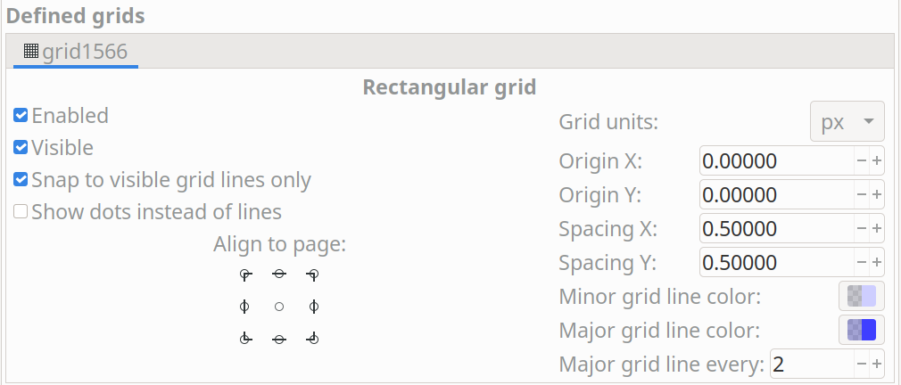

:toc:

== 0. Community Contributions

In general, KiCad does not accept contributions of graphic assets (icons, etc.) from the community
directly.  The lead development team may make small tweaks to icons themselves, but aims to employ
professional graphic designers for larger changes and development of new assets.

Community contributors looking to add new features to KiCad that require new art assets (for
example, adding a tool that requires a toolbutton icon) may create placeholder art to be used until
a final asset can be created.  This placeholder art may be modified or replaced at the discretion
of the KiCad lead development team in coordination with an external designer.

This policy is aimed at achieving a consistent and unified look and feel for KiCad and also
removing debate over art assets from the review process for community contributions.  We still
welcome feedback and suggestions related to art assets from the community, and will consider this
type of input when discussing changes or additions to KiCad's art assets.

The following guidelines are presented for reference and represent the current consensus of the
lead development team.  New placeholder art assets should attempt to follow these guidelines.

== 1. Look and Feel

The KiCad icon design guidelines are intended to create a consistent visual
style for icons across KiCad.  The visual style is intended to provide a
balance between each icon being unique enough that it is easy to locate, but
not so unique that there is no consistent theme among all the icons and it
looks like each was designed by a different person. The general principles of
that visual style are:

1. **Flat design**:  icons should not use gradients, shadows, or other “3D” effects.
2. **Standard color palette**: icons should make use of a restricted color palette,
   listed in this document.  Additions to or changes to this color palette must
   be discussed with the lead development team, as it could require changing many
   icons for the sake of consistency.
3. **Use color sparingly where shape is sufficient**: color should be used to
   clarify differences between icons that have similar shapes.  Icons that can
   convey their meaning through shape alone (and not be confused with other icons)
   should be monochrome, just using the primary color (Dark Grey in the light theme)
4. **Pixel alignment**: icons are designed as vectors but used as bitmaps.  Vector
   graphics must be designed for proper pixel alignment at the target icon size(s)
   to prevent blurriness.
5. **Consistency**: icons describing the same concept should be consistent in their
   use of color and shape to describe that concept.  For example, all icons that
   include control points should make those control points Blue in color.
6. **Minimalism**: not much detail is preserved in a 24x24 icon.  Be sparing with the
   use of fine features, especially when those fine features are all that tell
   one icon apart from another.
7. **Window theme aware**: even setting aside those operating systems with “dark modes”,
   the window background color of KiCad can vary quite a lot across operating systems.
   Be careful when using colors in ways that may disappear against the window background.
   In particular, Accent Gray, White, and Schematic Tan will be very hard to see against
   the window background.  Only use these colors on top of a background of a different
   color to create sufficient contrast.

== 2. Technical Requirements and Licensing

Icons must be developed as SVG files.  Building and testing icon changes requires you to have
Inkscape and pngcrush installed, as detailed in the CMakeLists.txt file in the bitmaps_png source
directory.  If your version of pngcrush does not match that used by the lead development team
(1.8.13), you will see a large number of differences in your source tree.

Icons must be licensed as Creative Commons Attribution-ShareAlike (CC-BY-SA) using an embedded
license in the SVG file.  This can be added in Inkscape using the Document Properties dialog.

== 3. Authoring Software

SVG files must be edited in Inkscape 1.0 or higher.  While other packages such as Adobe
Illustrator are able to export SVG files, they export only the look of the icon.  They frequently
skip other details such as layers, hidden lines, clipping, grids and licenses that make the file
easier to edit in the future.  We recommend making use of the Icon Preview feature in Inkscape to
make sure your vector graphics are properly aligned to the pixel grid and will be clear at the
target size.

== 4. Grids

The icon file must have a grid set in the Inkscape SVG file.  The grid units must be `px` with an
origin at `0,0` and spacing of `0.5 px`.  The Minor grid line color should be `#ceceff20` and the
major grid line color should be `#3f3fff40`.  There should be a major grid line every 2 lines.

This allows both even and odd sized line widths to be pixel aligned on the grid.  This is set in
the Document Properties window as follows:

== 5. Icon Sizes

[%header,cols="1,4a"]
|===
|Size   |Uses
|16x16  |* Some UI buttons
         * Appearance panel visibility toggles
         * File icons
|24x24  |* All toolbar buttons
         * All menu icons (at the moment)
|48x48  |* Main program icons in KiCad manager
|128x128|* Main program icons (ico files)
|===

== 6. Colors

With few exceptions, only use the colors in these tables for SVG objects (additional colors will
exist in the generated bitmaps due to blending).

=== 6.1. Light Theme

[%header,cols="1,1a,4a"]
|===
|Color Name     |Color Value |Uses/Notes
|Primary Gray   |`#545454`   |This is the default color to use for all strokes.

Note that in dense fills (e.g. Save, Print, Paste icons) it will appear
darker than the identical grey in other icons.  For these cases we
use #`606060`.
|Medium Grey    |`#848484`   |Used for inactive objects to reduce contrast compared to Dark Grey
|Accent Grey    |`#B9B9B9`   |Used for the hole inside a via and the fill inside graphic shapes
|Primary Blue   |`#1A81C4`   |Used to accentuate certain details and for "back copper" in PcbNew
|Accent Blue    |`#39B4EA`   |Used to show zone fill in some places, and as an accent color
|Primary Red    |`#BF2641`   |Used for accents, badges, and "front copper" in PcbNew
|Gold           |`#F29100`   |Used for via copper, and (rarely) as an accent
|PCB Green      |`#489648`   |Used in the PcbNew program icon for traces
|PCB Dark Green |`#006400`   |Used in the PcbNew program icon for soldermask
|Schematic Tan  |`#D0C5AC`   |Used in the Eeschema icon and to represent schematic sheets
|Pure White     |`#FFFFFF`   |Used for contrast against dark colors and separation between objects
|Area Fill      |`#F3F3F3`   |Used for large fills of white (e.g. New) instead of Pure White
|===

=== 6.2. Dark Theme

[%header,cols="1,1a,4a"]
|===
|Color Name     |Color Value |Uses/Notes
|Primary Gray   |`#DED3DD`   |This is the default color to use for all strokes.

Note that in dense fills (e.g. Save, Print, Paste icons) it will appear
darker than the identical grey in other icons.  For these cases we
use #`606060`.
|Medium Grey    |`#848484`   |Used for inactive objects to reduce contrast compared to Dark Grey
|Accent Grey    |`#E0E0E0`   |Used for the hole inside a via and the fill inside graphic shapes
|Primary Blue   |`#42B8EB`   |Used to accentuate certain details and for "back copper" in PcbNew
|Accent Blue    |`#1A81C4`   |Used to show zone fill in some places, and as an accent color
|Primary Red    |`#F2647E`   |Used for accents, badges, and "front copper" in PcbNew
|Gold           |`#F29100`   |Used for via copper, and (rarely) as an accent
|PCB Green      |`#489648`   |Used in the PcbNew program icon for traces
|PCB Dark Green |`#006400`   |Used in the PcbNew program icon for soldermask
|Schematic Tan  |`#D0C5AC`   |Used in the Eeschema icon and to represent schematic sheets
|Pure White     |`#FFFFFF`   |Used for contrast against dark colors and separation between objects
|Area Fill      |`#545454`   |Used for large fills of white (e.g. New) instead of Pure White
|===

== 7. Lines and Fills

Line weights in SVG files should usually be `1.5px` or heavier, to ensure that in the final
bitmap, there are pixels with the true color no matter the placement of the line with regards to
the pixel grid.  Horizontal and vertical lines should usually be `2px` where they convey the main
meaning of the image.  1px lines are OK when part of a larger whole.

Line weights representing certain concepts should be kept consistent throughout the icon set where
practical.  For example, graphical shape drawing tools use `2px` lines always.

In general the icon set uses "flat filled" shapes where applicable.  Maintain this visual style
when creating new icons.  Note that not all shapes must be filled -- stroked shapes with no fill
can be used (along with the window background color) to create a contrasting filled area.  Strokes
should be constant-width in general to avoid looking like hand-drawn brush strokes ("cartoon
style").

Fills should use solid colors in almost all instances.  Gradients should be used sparingly, and
generally not to create "3D" effects or the appearance of lighting/shadows.

== 8. Fonts

We use two fonts in the icons:  Noto Sans and Tiresias LPFont Bold. Noto Sans is used by default
for all text. Tiresias is used for the “Ki” logo.

Noto Sans may be used in different weights and spacing, e.g. Noto Sans Bold, Semi-condensed, if
needed for spacing or line weight.

Tiresias LPFont Bold may only be used as Tiresias LPFont Bold without substitution.

== 9. Badges

Badges are symbols that overlay other icons to add meaning.  These symbols come from a shared
library (badges.svg in the sources directory).  Always use the appropriate badge with consistent
placement (you can copy/paste from the badges SVG) rather than creating new artwork that conveys
the same meaning as a badge.

Badges should generally be used without modification, but in some cases it is helpful to add a
1px-1.5px stroke border (in Pure White for the light theme) to the outside of the badge to ensure
visual separation between the badge and the icon content underneath.
