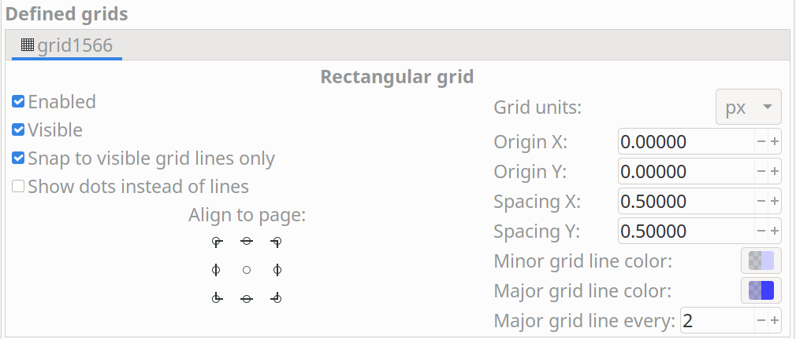

:toc:

== 1. 外观和感觉

KiCad 图标设计指南旨在为 KiCad 中的图标创建一致的视觉样式。
视觉风格的目的是在每个图标都足够独特，便于定位，但又不够奇特，
以至于所有图标之间没有一致的主题，
看起来每个图标都是由不同的人设计的之间取得平衡。
这种视觉风格的一般原则是：

1. **平面设计**：图标不能使用渐变、阴影等 3D 效果。
2. **标准调色板**：图标应使用本文档中列出的受限调色板。
   对此调色板的添加或更改必须与首席开发团队 (lead development team) 进行讨论，
   因为为了保持一致性，可能需要更改许多图标。
3. **在形状足够的地方要慎用颜色**：形状相似的图标应该用颜色来区分。
   仅能通过形状传达意义的图标 (不要与其他图标混淆) 应该是单色的，
   只使用原色 (在灯光主题中为深灰色) 
4. **像素对齐**：图标设计为向量，但用作位图。
   矢量图形必须设计为以目标图标大小正确对齐像素，
   以防止模糊。
5. **一致性**：描述相同概念的图标在使用颜色和形状来描述该概念时应该保持一致。
   例如，所有包含控制点的图标都应该将这些控制点设置为蓝色。
6. **极简主义**：24x24 图标保留的细节不多。
   避免使用精细特征，特别是当这些精细特征是区分图标的全部时。
7. **窗口主题感知**：即使撇开那些 “暗模式” 的操作系统不谈，
   KiCad 的窗口背景颜色在不同的操作系统上也会有很大的不同。
   在使用可能会在窗口背景中消失的颜色时要小心。
   特别是，在窗口背景下很难看到重音为灰色、白色和原理图的棕色。
   仅在不同颜色的背景上使用这些颜色以创建足够的对比度。

== 2. 技术要求和许可

图标必须开发为 SVG 文件。编译和测试图标更改需要安装 Inkscape 和 pngcrush，
详见 bitmap_png 源目录中的 CMakeLists.txt 文件。
如果您的 pngcrush 版本与主要开发团队使用的版本 (1.8.13) 不匹配，
您将在源代码树中看到大量差异。

图标必须使用 SVG 文件中的嵌入式许可证作为署名-相同方式共享 (CC-by-SA) 进行许可。
可以使用文档属性对话框将其添加到 Inkscape 中。

== 3. 创作软件

必须在 Inkscape 1.0 或更高版本中编辑 SVG 文件。
虽然其它软件包 (如 Adobe Illustrator) 可以导出 SVG 文件，但它们只能导出图标的外观。
他们经常跳过其他细节，例如图层、隐藏线、剪裁、网格和许可，这些细节使文件在将来更容易编辑。
我们建议使用 Inkscape 中的图标预览功能，以确保矢量图形与像素网格正确对齐，并且在目标大小下清晰可见。

== 4. 网格

图标文件必须在 Inkscape SVG 文件中设置网格。
网格单位必须为 `px`，原点为 `0,0`，间距为 `0.5px`。
次网格线颜色为 `#ceceff20`，主网格线颜色为 `#3f3fff40`。
每两条线应该有一条主要网格线。

这使得偶数和奇数大小的线宽都可以在网格上像素对齐。
这是在文档属性窗口中设置的，如下所示：

== 5. 图标大小

[%header,cols="1,4a"]
|===
| 大小   | 用途
|16x16  |* 一些 UI 按钮
         * 外观面板可见性切换
         * 文件图标
|24x24  |* 所有工具栏按钮
         * 所有菜单图标 (目前)
|48x48  |* KiCad 管理器中的主程序图标
|128x128|* 主程序图标 (ico 文件)
|===

== 6. 颜色

除极少数例外，仅将这些表中的颜色用于 SVG 对象 (由于混合，生成的位图中将存在其他颜色)。

=== 6.1. 亮色主题

[%header,cols="1,1a,4a"]
|===
|颜色名称               |颜色值       |用途/备注
|Dark Gray (暗灰色)     |`#545454`   |这是用于所有笔划的默认颜色。

请注意，在密集填充 (例如，保存、打印、粘贴图标) 中，它将比其他图标中相同的灰色显示得更暗。
对于这些情况，我们使用 `#606060`。
|Medium Grey (中灰色)   |`#848484`   |与深灰色相比，用于非活动对象以降低对比度
|Light Grey (浅灰色)    |`#B9B9B9`   |用于通孔内的孔和图形形状内的填充
|Primary Blue (原色蓝)   |`#1A81C4`   |用于强调某些细节，并用于 PcbNew 中的 “背面铜”
|Light Blue (浅蓝色)     |`#39B4EA`   |用于在某些地方显示区域填充，并作为强调色
|Primary Red (原色红)    |`#BF2641`   |用于 PcbNew 中的强调、标识和 “前面铜”
|Gold (金色)           |`#F29100`   |用于通孔铜色，(很少) 用作强调
|PCB Green (PCB 绿色)      |`#489648`   |用于布线的 PcbNew 程序图标
|PCB Dark Green (PCB 深绿色) |`#006400`   |用于阻焊层的 PcbNew 程序图标
|Schematic Tan (原理图色调) |`#D0C5AC`   |在 Eesschema 图标中使用，并用于表示原理图
|Pure White (纯白)     |`#FFFFFF`   |用于与深色的对比和物体之间的分隔
|Off White (灰白色)     |`#F3F3F3`   |用于较大的白色填充物 (例如新的)，而不是纯白色
|===

=== 6.2. 暗色主题

*尚未设计*

== 7. 线条和填充

SVG 文件中的线宽通常应为 `1.5px` 或更大，以确保在最终的位图中，
无论线条相对于像素网格的位置如何，都有具有真实颜色的像素。
水平线和垂直线通常应该是 `2px`，它们传达了图像的主要含义。
当 1px 线条是较大整体的一部分时，可以使用 1px 线条。

在可行的情况下，代表某些概念的线宽应该在整个图标集中保持一致。
例如，图形形状绘制工具总是使用 `2px` 线。

一般来说，图标集在适用的情况下使用 “扁平填充” 形状。
创建新图标时保持此视觉样式。
请注意，并非所有形状都必须填充 - 可以使用无填充的描边形状 (与窗口背景色一起) 来创建对比鲜明的填充区域。
笔画一般应该是等宽的，以避免看起来像手绘笔画 (“卡通风格”)。

几乎在所有情况下，填充都应该使用纯色。
渐变应该谨慎使用，通常不能用来创建 "3D" 效果或灯光/阴影的外观。

== 8. 字体

我们在图标中使用两种字体：Noto Sans 和 Tiresas LPFont Bold。
默认情况下，所有文本都使用 Noto Sans。
Tiresas 是用来做 “Ki” 标志的。

如果间距或线宽需要，Noto Sans 可以使用不同的重量和间距，例如 Noto Sans 粗体、半压缩。

Tiresas LPFont Bold 只能用作 Tiresas LPFont Bold，不得替换。

== 9. 标识

标识是覆盖在其他图标上以增加含义的符号。
这些符号来自一个共享库 (源目录中的 badges.svg)。
始终使用位置一致的适当标识 (您可以从标识 SVG 复制/粘贴)，而不是创建传达与标识相同含义的新图稿。

标识通常无需修改即可使用，但在某些情况下，在标识外部添加 1px-1.5px 的笔画边框 (对于浅色主题为纯白) 会很有帮助，以确保标识和下方图标内容之间的视觉分离。
